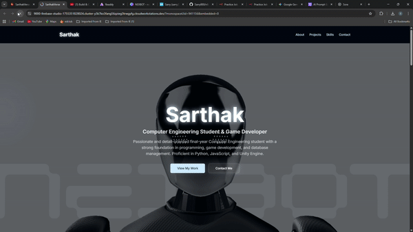

# SarthakVerse Portfolio - Personal Website

This is a personal portfolio website built with Next.js, showcasing my projects, skills, and providing a way to contact me. It was initially created in Firebase Studio and is designed to be a responsive and modern representation of my work.



To get started, take a look at `src/app/page.tsx`.

## Technologies Used

*   **Next.js:** A React framework for server-side rendering and static site generation.
*   **React:** A JavaScript library for building user interfaces.
*   **TypeScript:** A typed superset of JavaScript that compiles to plain JavaScript.
*   **Tailwind CSS:** A utility-first CSS framework for rapidly building custom designs.
*   **Firebase:** Used for backend services (specifically for the contact form).
*   **Google Gemini:** Integrated for AI functionality, likely powering the contact form's email sending feature.

## Features

*   **Projects Section:** Displays a portfolio of my work.
*   **Skills Section:** Highlights my technical skills.
*   **Contact Section:** Provides a form for visitors to get in touch.
*   **Responsive Design:** Adapts to different screen sizes.

## Usage

As a personal portfolio website, the primary usage is for visitors to view my projects, learn about my skills, and contact me through the provided form.


## Running Locally

To run this project on your local machine, you'll need to have [Node.js](https://nodejs.org/) (which includes npm) installed.

1.  **Download Your Code:** First, you'll need to get the code from your project onto your computer.

2.  **Open a Terminal:** Navigate to your project's root directory in your terminal or command prompt.

3.  **Install Dependencies:** Run the following command to install all the necessary packages:
    ```bash
    npm install
    ```

4.  **Set Up Environment Variables:** Create a new file in the root of your project named `.env` and add any necessary environment variables. For the AI features (like the contact form) to work, you will need a Gemini API key. You can get one from [Google AI Studio](https://aistudio.google.com/app/apikey).
    ```.env
    GEMINI_API_KEY=YOUR_API_KEY_HERE
    ```

5.  **Run the Development Servers:** You need to run two servers simultaneously for the full application to work.

    *   **Next.js App (in your first terminal):**
        ```bash
        npm run dev
        ```
        This will start the website, typically on [http://localhost:9002](http://localhost:9002).

    *   **Genkit AI Flows (in a second terminal):**
        ```bash
        npm run genkit:dev
        ```
        This starts the server that handles the AI functionality.

You should now have the full application running locally!

## Sharing on GitHub

To share your project on GitHub and deploy it as a live website using GitHub Pages, follow these steps.

### Part 1: Get Your Code on GitHub

1.  **Create a GitHub Repository:** Go to [GitHub](https://github.com) and create a new, empty repository. Do not initialize it with a README or license file.
2.  **Initialize Git Locally:** Open a terminal in your project's root folder and run these commands:
    ```bash
    git init
    git add .
    git commit -m "Initial commit"
    ```
3.  **Connect and Push:** Connect your local project to the GitHub repository you just created and push your code. Replace `<YOUR_USERNAME>` and `<YOUR_REPOSITORY_NAME>` with your actual GitHub details.
    ```bash
    git remote add origin https://github.com/<YOUR_USERNAME>/<YOUR_REPOSITORY_NAME>.git
    git branch -M main
    git push -u origin main
    ```

### Part 2: Deploy to GitHub Pages

Your project is already configured with a script to build and deploy your site.

1.  **Run the Deploy Script:** In your terminal, run the following command:
    ```bash
    npm run deploy
    ```
    This command will build your Next.js application, create a static version in an `out` folder, and then automatically push that folder to a `gh-pages` branch in your repository.

2.  **Configure GitHub Pages:**
    *   In your GitHub repository, go to `Settings` > `Pages`.
    *   Under "Build and deployment", set the **Source** to **Deploy from a branch**.
    *   Set the **Branch** to `gh-pages` and the folder to `/ (root)`.
    *   Click **Save**.

After a few minutes, your website will be live at `https://<YOUR_USERNAME>.github.io/<YOUR_REPOSITORY_NAME>/`.
